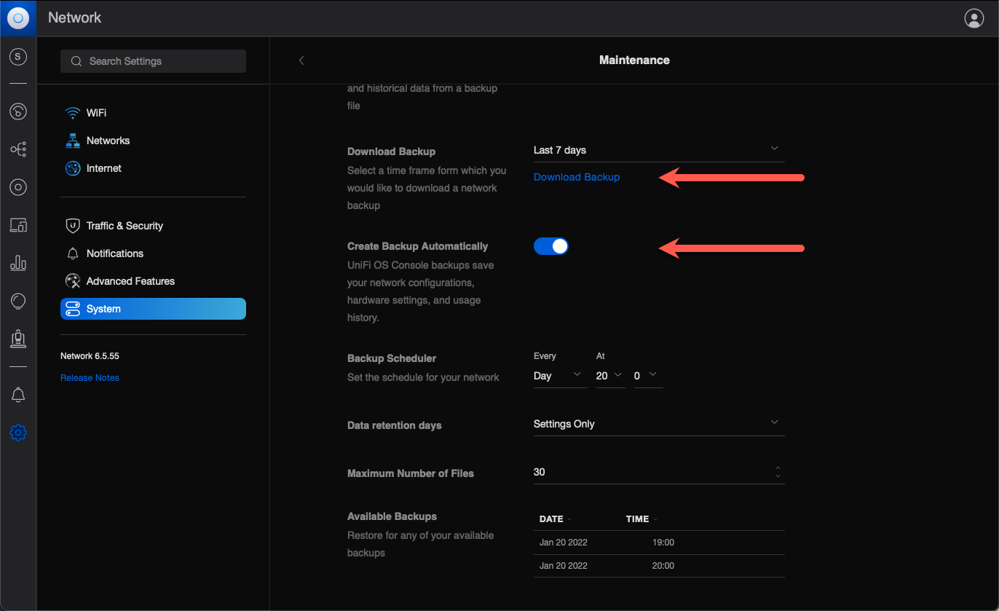

# Failing to create backups from web UI

This text is about problems relating to backups and downloading of backup files.

## Background

Doing backups of your Unifi configuration is important.  
Without backups you run the risk of having to re-configure everything if your controller for some reason dies. This can be a massive task for large networks.

This text is an attempt at providing some more context and concrete commands to solve the problems discussed in [this issue](https://github.com/serkbugs/unifi-docker/issues/512).

## Problem

After doing a fresh install of the Unifi controller using this Docker image you *may* run into errors when trying to do backups.  
Depending on your local setup things may work fine out of the box, but in other cases you can run into this backup problem.

Clicking the "Download Backup" link simply does... nothing.



A closer look into the logs is easy though (adapt container name as needed):

```bash
docker logs unifi_logs -f
```

If you see something like the below you probably suffer from the download-backups-problem:

```
[2022-01-20T14:00:01,290] <schedule-backup> ERROR system - zipDir error
java.io.FileNotFoundException: /usr/lib/unifi/data/backup/autobackup/autobackup_6.5.55_20220120_1300_1642683600011.unf (No such file or directory)
```

## Configuration

The Docker container was started with this `docker-compose.yaml` file, which is pretty much standard except for the hard-coded container names:

```yaml
version: '2.3'
services:
  mongo:
    image: mongo:3.6
    # container_name: ${COMPOSE_PROJECT_NAME}_mongo
    container_name: unifi_mongo
    networks:
      - unifi
    restart: always
    volumes:
      - db:/data/db
      - dbcfg:/data/configdb
  controller:
    # image: "serkbugs/unifi:${TAG:-latest}"
    image: serkbugs/unifi-docker:latest
    # container_name: ${COMPOSE_PROJECT_NAME}_controller
    container_name: unifi_controller
    depends_on:
      - mongo
    init: true
    networks:
      - unifi
    restart: always
    volumes:
      - dir:/unifi
      - data:/unifi/data
      - log:/unifi/log
      - cert:/unifi/cert
      - init:/unifi/init.d
      - run:/var/run/unifi
      # Mount local folder for backups and autobackups
      - ./backup:/unifi/data/backup
    user: unifi
    sysctls:
      net.ipv4.ip_unprivileged_port_start: 0
    environment:
      DB_URI: mongodb://mongo/unifi
      STATDB_URI: mongodb://mongo/unifi_stat
      DB_NAME: unifi
      TZ: Europe/Stockholm
    ports:
      - "3478:3478/udp" # STUN
      - "6789:6789/tcp" # Speed test
      - "8080:8080/tcp" # Device/ controller comm.
      - "8443:8443/tcp" # Controller GUI/API as seen in a web browser
      - "8880:8880/tcp" # HTTP portal redirection
      - "8843:8843/tcp" # HTTPS portal redirection
      - "10001:10001/udp" # AP discovery

  logs:
    image: bash
    # container_name: ${COMPOSE_PROJECT_NAME}_logs
    container_name: unifi_logs
    depends_on:
      - controller
    command: bash -c 'tail -F /unifi/log/*.log'
    restart: always
    volumes:
      - log:/unifi/log

volumes:
  db:
  dbcfg:
  data:
  log:
  cert:
  init:
  dir:
  run:

networks:
  unifi:
```

## Investigation

The Docker container will use user `unifi` to run the controller.  
Looking at the /etc/passwed file in the running container we get:

```bash
root@abc1:/opt/docker/container# docker exec -it unifi_controller bash
unifi@2ddc781f5259:/unifi$ cat /etc/passwd
root:x:0:0:root:/root:/bin/bash
daemon:x:1:1:daemon:/usr/sbin:/usr/sbin/nologin
bin:x:2:2:bin:/bin:/usr/sbin/nologin
sys:x:3:3:sys:/dev:/usr/sbin/nologin
sync:x:4:65534:sync:/bin:/bin/sync
games:x:5:60:games:/usr/games:/usr/sbin/nologin
man:x:6:12:man:/var/cache/man:/usr/sbin/nologin
lp:x:7:7:lp:/var/spool/lpd:/usr/sbin/nologin
mail:x:8:8:mail:/var/mail:/usr/sbin/nologin
news:x:9:9:news:/var/spool/news:/usr/sbin/nologin
uucp:x:10:10:uucp:/var/spool/uucp:/usr/sbin/nologin
proxy:x:13:13:proxy:/bin:/usr/sbin/nologin
www-data:x:33:33:www-data:/var/www:/usr/sbin/nologin
backup:x:34:34:backup:/var/backups:/usr/sbin/nologin
list:x:38:38:Mailing List Manager:/var/list:/usr/sbin/nologin
irc:x:39:39:ircd:/var/run/ircd:/usr/sbin/nologin
gnats:x:41:41:Gnats Bug-Reporting System (admin):/var/lib/gnats:/usr/sbin/nologin
nobody:x:65534:65534:nobody:/nonexistent:/usr/sbin/nologin
_apt:x:100:65534::/nonexistent:/usr/sbin/nologin
unifi:x:999:999::/home/unifi:/bin/sh
mongodb:x:101:102::/var/lib/mongodb:/usr/sbin/nologin
unifi@2ddc781f5259:/unifi$
```

Looks like the `unifi` user in the running container has userid=999 and groupid=999.

Now, let's take a look at that path we get an error for in the logs:

```bash
unifi@64602e3bbf81:/unifi$ ls -la /usr/lib/unifi/data/backup/
total 8
drwxr-xr-x 2 root  root  4096 Jan 20 13:14 .
drwxr-xr-x 4 unifi unifi 4096 Jan 20 13:42 ..
unifi@64602e3bbf81:/unifi$
```

See how the current directory (`.`) has an owner of `root:root`, whereas the directory above it has `unifi:unfi` as owner?  
That's a clue that there is a permissions problem.

Going back to the docker-compose file, we can see that `/unifi/data/backup` in the container is mapped to `./backup` on the host computer.  

Next step is to check the permissions on the host computer for that `./backup` directory. It must be readable/writable by the container's `unifi:unifi` acount - otherwise the code running in the container won't be able to access anything in `/unifi/data/backup` and below.

```bash
root@abc1:/opt/docker/container/unifi-controller# ls -la
total 16
drwxr-xr-x  3 root root 4096 Jan 20 13:14 .
drwxr-xr-x 47 root root 4096 Nov 21 20:04 ..
drwxr-xr-x  2 root root 4096 Jan 20 13:14 backup
-rw-r--r--  1 root root 2590 Jan 20 13:10 docker-compose.yaml
root@abc1:/opt/docker/container/unifi-controller#
```

Ah! The second last line (for the backup subdirectory) has an owner of `root:root` (that's the host's root user, btw).  
No good. It must be a user on the host with userid:groupid of 999:999.

The solution would then be to create a suitable user on the host computer and then change the owner of the `./backup` directory.

## Solution

It should be noted that the problem described in this text can be solved in several ways. The container could be made to use another user (that already exists on the host computer), the container could be forced to run as root etc.  
What's described below worked in one case, but your milage may vary.

### Create unifi user on host computer

The command below is executed as root. Doing a sudo should achieve the same result.

```bash
root@abc1: adduser --uid 999 --gid 999 unifi
```

### Changing owner of backup directory on host

```bash
root@abc1:/opt/docker/container/unifi-controller# chown -R 999:999 backup
root@abc1:/opt/docker/container/unifi-controller# ls -la
total 16
drwxr-xr-x  3 root  root   4096 Jan 20 13:14 .
drwxr-xr-x 47 root  root   4096 Nov 21 20:04 ..
drwxr-xr-x  3 unifi unifi  4096 Jan 20 18:31 backup
-rw-r--r--  1 root  root   2590 Jan 20 13:10 docker-compose.yaml
root@abc1:/opt/docker/container/unifi-controller#
```

Great, the `./backup` directory now has the permissions needed in order for the container's unifi user to access it.

### Testing the solution

Restart the container, then try downloading the backup file again.  
Should work - at least if your original issues was the same that lead up to this walk-through...

## Automatic backups

Good news: The work above also fixes automatic backups.

The automatic backups rely on files in the same backup directory structure within the container as the manual backups.  

Give it a try: Set a time for automatic backups and check back once that time has passed. There should now be a downloadable backup file in the web UI.  
Examples of such files are shown in the screen shot above.
